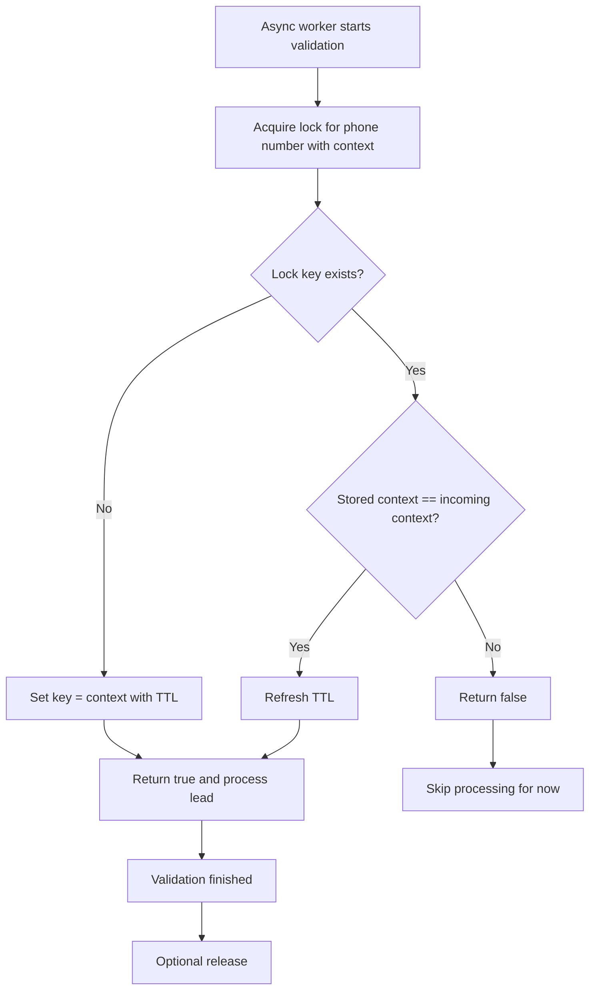

# Context Lock for Phone Number Validation

We run a sales system that collects leads from external data providers. One recurring headache with this kind of integration is duplicates. Some providers would resend the exact same lead with a different `Idempotency-Key`, others wouldn't send an idempotency key at all. A naive idempotency check at the API boundary wasn't enough to stop the same contact from entering our pipeline twice.

So, basic idempotency validation at request level was not enough.
The same contact could still reach async processing more than once.

## Processing Flow

1. Lead arrives.
2. Idempotency key is validated (if present).
3. Lead is persisted.
4. Async validation starts (including phone number checks).
5. Lead is accepted or rejected by the state machine.

Important detail: we keep all incoming leads for business history, including duplicates.
Rejected leads stay in storage for business and audit reasons, but are not processed or shown further.

## Why Plain Redis Lock Was Not Enough

We needed a lock on the phone number in async validation.
But a plain lock failed in two cases:

1. One phone number could appear in more than one lead.
2. Async processing could fail and retry.

On retry, the same lead should continue.
With a plain lock, it would be blocked until TTL expiry.

## Context Lock Rules

Each phone-number lock stores a `context` (processing identifier).
- key missing -> acquire lock (`true`)
- same context -> refresh TTL and return `true`
- different context -> do not refresh TTL and return `false`

This gave us the behavior we needed:
same process retry = allowed, competing process = blocked.

Release was added as optional cleanup.
Core safety still comes from context check + TTL.

## How It Works

## Links

- Full library: [klukov-utils-redis](https://github.com/Klukov/klukov-utils-redis/)
- [`ContextRedisLock.java`](https://github.com/Klukov/klukov-utils-redis/blob/master/src/main/java/org/klukov/utils/redis/lock/context/ContextRedisLock.java)
- [`context-lock-acquire.lua`](https://github.com/Klukov/klukov-utils-redis/blob/master/src/main/resources/redis/context-lock-acquire.lua)
- [`context-lock-release.lua`](https://github.com/Klukov/klukov-utils-redis/blob/master/src/main/resources/redis/context-lock-release.lua)

